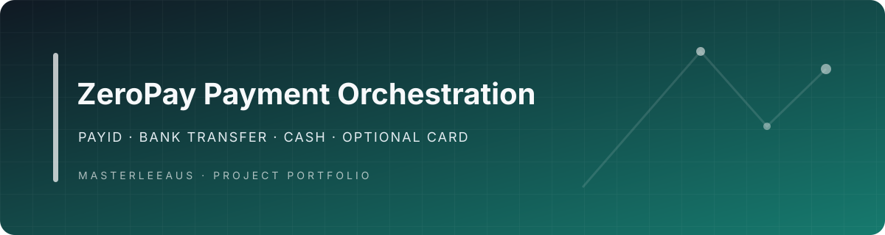

<p align="center">
  
</p>

<h1 align="center">ZeroPay Payment Orchestration</h1>

<p align="center"><strong>Payments without the percentage tax.</strong></p>

ZeroPay is a payment orchestration platform built around a simple idea: **help sellers get paid through payment rails that can avoid conventional card-processing fees wherever possible.**

Instead of making Stripe-style percentage fees the default path for every transaction, ZeroPay puts direct and low-cost payment methods first - including **PayID, Osko-enabled bank payments, direct bank transfer, cash and cryptocurrency** - while retaining conventional payment gateways as optional fallbacks when they are useful.

For a seller, the difference is structural. ZeroPay is designed to route customers toward payment methods where the seller can receive the full payment rather than automatically surrendering a percentage of every sale to a card processor.

The platform coordinates the payment lifecycle across mobile, web, PWA, API and administrative surfaces, combining payment sessions, QR-driven transactions, direct-payment instructions, bank-transfer matching, wallets, gateway adapters, notifications, reconciliation and intelligent automation.

> **ZeroPay does not make an underlying bank, network or cryptocurrency transfer universally free. Fees and availability depend on the customer's and seller's providers, accounts, networks and transaction type. The product's purpose is to prioritise payment rails that can be zero-cost to the seller rather than assuming a percentage-based processor is required.**

<p align="center">
  
</p>

## Product architecture and engineering highlights

A payment-orchestration platform that puts direct account-to-account and cash options alongside conventional gateways in one payment lifecycle.

- **Architecture:** Payment sessions normalize QR entry, PayID/Osko instructions, bank-transfer matching, cash records, cryptocurrency adapters, gateway checkout, notifications, and reconciliation.
- **Distinctive engineering:** The distinctive architecture separates the customer payment experience from the rail used to settle it, while keeping card gateways available where needed. Fees and availability remain provider-dependent.

## The ZeroPay model

```text
                         Customer wants to pay
                                  |
                                  v
                         ZeroPay Payment Session
                                  |
                    +-------------+-------------+
                    |                           |
                    v                           v
          Zero/low seller-fee paths      Optional gateways
                    |                           |
        +-----------+-----------+          +----+----+
        |           |           |          |         |
      PayID       Bank        Crypto     Stripe    PayPal
      / Osko     Transfer        |
        |           |           |
        +-----------+-----------+
                    |
                    v
            Match / Confirm Payment
                    |
                    v
        Transaction + Evidence + Events
                    |
                    v
            Seller receives funds
```

The orchestration layer lets ZeroPay present the most appropriate payment options without coupling the seller's business to one processor.

## Zero-fee-first payment options

### PayID and Osko-enabled payments

For Australian payment flows, ZeroPay can use PayID/direct bank-payment instructions so customers can pay through participating financial institutions using Australia's real-time account-to-account payment infrastructure.

The important product distinction is that ZeroPay does not need to sit in the middle of the money flow and charge the seller a percentage of the transaction simply to initiate a payment.

ZeroPay can create the payment context, present instructions or QR-driven information, identify the expected payment and reconcile the resulting transfer back to the correct payment session.

### Direct bank transfer

Direct account-to-account transfer is treated as a first-class payment rail rather than an awkward manual fallback.

The platform includes a bank-transfer matching pathway that connects incoming deposits with expected payment sessions. Unmatched deposits can be surfaced for operator review instead of disappearing into a generic bank statement reconciliation process.

### Cash

Cash remains a valid payment method for many field-service, local-service and face-to-face businesses.

ZeroPay can record and reconcile cash as part of the same transaction model, allowing businesses to retain consistent payment records without forcing a digital processor into a transaction that does not need one.

### Cryptocurrency

Crypto payment support provides another direct payment path where appropriate. ZeroPay's adapter architecture allows cryptocurrency payment providers or wallet flows to participate alongside conventional payment rails rather than requiring a separate payment system.

Network, conversion or provider fees may still apply depending on the cryptocurrency and payment path.

### Conventional gateways when needed

ZeroPay is **zero-fee-first, not gateway-hostile**.

Stripe, PayPal and other processors can remain available when card acceptance, buyer preference, international reach or another capability makes them the better option.

The difference is that they become **options**, not the architecture.

## Why this matters

Percentage-based processing costs scale directly with revenue. A business that grows its sales also grows the amount surrendered to payment intermediaries, even when many customers could have paid through direct account-to-account methods.

ZeroPay separates the customer payment experience from the payment processor so a business can offer multiple rails through one operating layer.

The seller can prioritise direct payment methods while preserving familiar alternatives for customers who need them.

## QR-driven payments

QR interaction gives ZeroPay a common entry point across different payment rails.

A payment session can carry the context needed to connect a customer with an appropriate payment path without making the seller maintain separate checkout experiences for each rail.

QR-driven workflows can support:

- payment-session identification;
- payment amount and reference context;
- PayID/direct-payment instructions;
- payment links;
- wallet or crypto flows;
- conventional gateway fallback;
- transaction confirmation and history.

## Payment sessions

Payment sessions provide the common domain model underneath the different rails.

The platform supports lifecycle concepts for creating, opening, completing, expiring and failing payment flows while retaining transaction state and history.

This means the business can reason about **a payment** independently of whether the customer ultimately uses PayID, bank transfer, cash, crypto or a conventional gateway.

## Reconciliation engine

Direct payments become much more useful when reconciliation is automated.

ZeroPay's bank-transfer workflow is designed to match incoming deposits against expected payments and maintain an exception path for unmatched deposits requiring operator intervention.

That closes one of the major usability gaps between processor-managed card payments and direct bank payments: the seller can reduce processor dependence without giving up structured transaction records.

## Gateway abstraction

ZeroPay uses payment contracts and adapters instead of spreading provider-specific logic throughout the application.

Payment paths represented in the repository include:

- PayID
- bank transfer
- cash/manual payment
- cryptocurrency / Cryptomus
- Stripe
- PayPal

New payment rails can be integrated behind the same orchestration model without redesigning the core transaction domain.

## Multi-surface payment experience

ZeroPay is designed to operate across the places where payments actually happen:

- **Flutter mobile application** for Android and iOS;
- **Progressive Web App** for installable web access;
- **web surface**;
- **REST API** for connected applications;
- **administrative operations** for payment management and exceptions;
- **webhooks and events** for system integration.

The same payment domain can therefore support customers, sellers, staff and connected business systems.

## Intelligence and automation

`Modules/ZeroPayModule` includes dedicated `AI`, `Agents` and `Automation` domains alongside the payment engine.

These provide a foundation for intelligent payment operations such as:

- reconciliation assistance;
- exception triage;
- payment-status reasoning;
- workflow automation;
- operational decision support;
- selecting or recommending appropriate payment paths.

The underlying transaction state remains explicit and inspectable rather than being hidden behind an AI layer.

### AI implementation status

The repository contains a concrete module-agent contract, not a claim of a finished autonomous payment operator. [`Agents/ModuleAgent/agent.manifest.json`](Modules/ZeroPayModule/Agents/ModuleAgent/agent.manifest.json) declares grounded, citation-aware lookup capabilities for payment sessions, transactions, gateway status and deposit matching. [`AI/Actions/action-map.json`](Modules/ZeroPayModule/AI/Actions/action-map.json), [`AI/Guardrails/guardrails.json`](Modules/ZeroPayModule/AI/Guardrails/guardrails.json) and the control/channel manifests connect those tools to tenant scope, permission checks, audit logging, redaction and confirmation for writes.

The canonical route is explicit: [`module.json`](Modules/ZeroPayModule/module.json), [`manifests/module-agent.json`](Modules/ZeroPayModule/manifests/module-agent.json), [`AI/Control/control.manifest.json`](Modules/ZeroPayModule/AI/Control/control.manifest.json), [`AI/Voice/voice.manifest.json`](Modules/ZeroPayModule/AI/Voice/voice.manifest.json) and the Filament module page select `zeropay.module.agent` backed by [`Agents/ModuleAgent/agent.manifest.json`](Modules/ZeroPayModule/Agents/ModuleAgent/agent.manifest.json). [`Agents/DemoAgent/`](Modules/ZeroPayModule/Agents/DemoAgent/) remains an isolated scaffold for the explicitly named demo control panel; its empty evaluation suite is not production evidence.

The provider-independent contract check is:

```bash
php Modules/ZeroPayModule/Tests/Contract/run_agent_contract_checks.php
```

It validates routing, tenant/confirmation guardrails, approved knowledge paths and fixture-only agent/payment response shapes. It does not call TitanAgents, payment gateways or banking rails.

## Operations and control

Backend capabilities include:

- payment-session management;
- transaction resources and history;
- unmatched-deposit review;
- KPI widgets;
- control-panel functionality;
- notification handling;
- event-driven processing;
- reconciliation workflows.

## Architecture

```text
ZeroPay
|
+-- Customer-facing surfaces
|   +-- Mobile
|   +-- PWA
|   +-- Web
|   +-- QR / payment links
|
+-- Payment orchestration
|   +-- Payment sessions
|   +-- Transaction lifecycle
|   +-- Payment-method selection
|   +-- Events / notifications
|
+-- Direct payment rails
|   +-- PayID / Osko-enabled bank payments
|   +-- Bank transfer
|   +-- Cash
|   +-- Cryptocurrency
|
+-- Optional gateway adapters
|   +-- Stripe
|   +-- PayPal
|   +-- Cryptomus
|   +-- Extensible provider contracts
|
+-- Reconciliation
|   +-- Transfer matching
|   +-- Unmatched-deposit review
|   +-- Transaction evidence
|
+-- Intelligence / automation
    +-- AI
    +-- Agents
    +-- Automation
```

## Repository structure

```text
ZeroPay/
��� Modules/
�   ��� ZeroPayModule/     # Payment domain, APIs, adapters and operations
��� Mobile/                # Canonical Flutter Android/iOS application
��� PWA/                   # Progressive web application
��� Web/                   # Web-facing surface
��� mobile/                # Alternate historical mobile tree pending reconciliation
��� .github/workflows/     # Backend and Flutter CI
```

## ZeroPayModule

The backend is organised as a modular application domain rather than a collection of processor calls:

```text
AI/
Actions/
Adapters/
Agents/
Automation/
Config/
Console/
Contracts/
Data/
Database/
Docs/
Events/
Exceptions/
```

This keeps orchestration, payment adapters, domain contracts, persistence, automation and operational intelligence independently maintainable.

Useful source locations:

- `Actions/`, `Services/PaymentSessionService.php` and `Models/` - session lifecycle, transaction state and tenant-scoped persistence.
- `Adapters/` and `Services/GatewayRegistry.php` - PayID, bank transfer, cash, crypto, PayPal and Stripe gateway boundaries.
- `Services/BankTransferMatchingService.php` - direct-payment reconciliation and unmatched-deposit handling.
- `Agents/ModuleAgent/`, `AI/Actions/`, `AI/Guardrails/` and `AI/Control/` - grounded agent tools, policy boundaries and channel control.
- `Tests/Feature/` and `Tests/Unit/` - module installation, session APIs, tenancy, QR payloads, gateway adapters and bank matching.

## Focused module verification

The module has its own Composer and PHPUnit configuration:

```bash
cd Modules/ZeroPayModule
composer install
vendor/bin/pint --test
vendor/bin/phpunit --testdox Tests/
```

The repository also includes Flutter CI for the canonical `Mobile/` tree:

```bash
cd Mobile
flutter pub get
flutter analyze
flutter build apk --debug
```

These commands require the host/runtime dependencies. The checked-in manifests and tests are evidence of module contracts and intended integration; they are not evidence that external gateways, TitanCore/TitanAgents runtime wiring, banking rails or mobile release signing have been exercised here.

## Mobile development

The canonical Flutter application is under `Mobile/`.

```bash
cd Mobile
flutter pub get
flutter run
```

Release builds:

```bash
flutter build apk --release
flutter build ios --release
```

## Engineering principles

1. **Zero-fee-first** - prefer rails that can avoid percentage processing costs for the seller.
2. **Direct payments are first-class** - PayID, bank transfer, cash and crypto are not secondary manual fallbacks.
3. **Provider independence** - the business should not be structurally bound to one processor.
4. **Explicit transaction state** - payment transitions remain observable and auditable.
5. **Automated reconciliation** - direct payments should not require uncontrolled spreadsheet matching.
6. **Multiple rails, one payment model** - the business operates on payment sessions rather than provider-specific workflows.
7. **Multi-surface access** - native mobile, PWA, web, API and operator interfaces share the payment domain.
8. **Optional conventional processing** - card processors remain available when they add value rather than being mandatory.
9. **Automation without obscurity** - intelligent automation can assist operations without hiding the underlying payment state.

## Known repository boundaries

`Mobile/` is the canonical Flutter tree used by CI. The former lower-case `mobile/` tree is retained as `mobile-legacy/` for provenance and comparison. Keeping it under a distinct name removes the case-insensitive Windows collision without discarding its files. The same caution applies to the legacy web scaffolding under `Web/`. These are cleanup recommendations, not proof that the trees are unused.

No repository-level `LICENSE` or `NOTICE` file was verified in this checkout. Do not infer redistribution terms from the source layout; confirm the applicable legal/provenance terms before publication or deployment.

## Technology

The project spans:

- PHP / Laravel-style modular backend architecture
- Filament administrative resources
- Flutter / Dart mobile application
- Progressive Web App
- REST APIs and webhooks
- event-driven payment processing
- GitHub Actions CI

## Status

**Active development.**

ZeroPay is being developed as a zero-fee-first payment operating layer that lets businesses combine direct payment rails and conventional gateways behind one customer and operational experience.

Production deployment requires environment-specific banking/payment-provider configuration, security controls, webhook configuration and infrastructure validation.

---

### ZeroPay's core idea

**Don't charge the seller a percentage merely because software helped the customer pay.**

