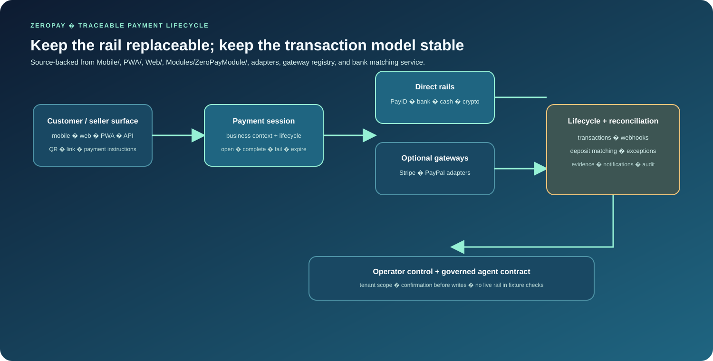

<p align="center">
  
</p>

<h1 align="center">ZeroPay</h1>

<p align="center"><strong>Payment orchestration for businesses that want direct rails first and processor choice when it matters.</strong></p>

## Overview

ZeroPay gives sellers one payment model for PayID and bank transfer, cash, cryptocurrency adapters, and optional card gateways. It turns each payment into a traceable session with a clear lifecycle, reconciliation path, operator controls, and customer-facing surfaces across mobile, web, PWA, and API.


## Measured evidence

ZeroPay has two useful verification layers: domain/module tests and a provider-free AI/payment contract runner.

The contract runner checks that:

- the canonical `zeropay.module.agent` is the default routed agent;
- the demo scaffold remains isolated and hidden;
- mapped tools are tenant-scoped;
- write tools require confirmation;
- the Filament, control and voice manifests all resolve to the canonical module agent;
- grounded fixture answers preserve source references;
- an unconfirmed payment-session write is rejected;
- a confirmed write reaches the fixture provider;
- payment-session fixture state preserves gateway, amount and currency.

Reproduce without banking or AI-provider credentials:

```bash
php Modules/ZeroPayModule/Tests/Contract/run_agent_contract_checks.php
```

The module also defines focused PHPUnit coverage for installation, tenancy, session APIs, QR payloads, adapters, bank matching, actions and Filament behavior. These checks establish code contracts; they do **not** prove real settlement, gateway approval or banking-rail operation.

## What is new

The technical signature is **rail-independent payment-session orchestration with explicit reconciliation and operator exception handling**.

```text
Customer / seller intent
      ↓
Payment session
      ↓
Rail adapter
 ┌────┼───────────────┐
PayID bank cash crypto optional card
 └────┼───────────────┘
      ↓
Transaction lifecycle
      ↓
Matching / reconciliation
      ↓
Evidence + operator review
```

The AI layer is deliberately secondary to the payment domain. It can inspect grounded session, transaction, gateway and matching state, but confirmation, tenant scope and the payment services remain the authority for consequential writes.

**Positioning boundary:** ZeroPay is **zero-fee-first**, not a guarantee that every bank, network, gateway or transaction is free.

## Product model

Payment processing often forces a business to choose between a single provider and a fragmented set of manual alternatives. ZeroPay treats the payment rail as an implementation choice behind one operational domain:

- create a payment session and expose the right QR, link, or payment instructions;
- accept direct account-to-account, cash, crypto, or conventional gateway payments;
- match incoming bank deposits to expected sessions and surface exceptions for review;
- retain transaction state, evidence, notifications, and operator history in one place.

The product is **zero-fee-first**, not fee-free by guarantee: providers, banks, networks, and transaction types can still charge fees. The engineering goal is to keep direct rails viable without making a percentage-based card processor the only architecture.

## Architecture

<p align="center">
  
</p>

ZeroPay separates the customer payment experience from the rail used to settle it. A payment session carries the business context; adapters and services handle the rail-specific behavior; events and reconciliation preserve what happened.

```text
Customer / seller surface
        |
        v
Payment session and QR/link context
        |
        +--> PayID / bank transfer / cash / crypto adapters
        |
        +--> Stripe / PayPal gateway adapters when needed
        |
        v
Transaction lifecycle + matching + evidence + events
```

That boundary keeps provider-specific calls out of the core transaction model. It also gives an operator a useful exception path when a direct transfer cannot be matched automatically.

## Verified capabilities

### Payment domain

- Payment sessions with explicit open, complete, fail, expire, lookup, update, and QR-refresh actions.
- Transaction and session resources, webhook handling, notifications, and lifecycle events.
- Gateway contracts and a registry for PayID, bank transfer, cash, Cryptomus, Stripe, and PayPal paths.
- Bank-transfer matching through `Services/BankTransferMatchingService.php`, including unmatched-deposit handling for operator review.
- Tenant-aware module services, permissions, and audit-oriented operational surfaces.

### Customer and operator surfaces

- Flutter mobile application in `Mobile/` for Android and iOS flows.
- React/Vite PWA in `PWA/` with QR scanning, payment sessions, transaction history, and offline payment queues.
- Laravel/Vite web surface under `Web/00_App_Core/`.
- Filament module pages, resources, widgets, APIs, jobs, imports, and webhooks under `Modules/ZeroPayModule/`.

### AI and automation layer

The module contains a concrete, inspectable agent contract rather than an ungrounded claim of autonomous payments. The canonical `zeropay.module.agent` is declared in [`Agents/ModuleAgent/agent.manifest.json`](Modules/ZeroPayModule/Agents/ModuleAgent/agent.manifest.json). Its tools cover grounded session, transaction, gateway-status, and deposit-matching lookups.

The action map, guardrails, retrieval policy, citations schema, control manifest, and voice manifest connect that agent to tenant scope, permission checks, audit logging, redaction, and confirmation before writes:

- [`AI/Actions/action-map.json`](Modules/ZeroPayModule/AI/Actions/action-map.json)
- [`AI/Guardrails/guardrails.json`](Modules/ZeroPayModule/AI/Guardrails/guardrails.json)
- [`AI/Control/control.manifest.json`](Modules/ZeroPayModule/AI/Control/control.manifest.json)
- [`AI/Voice/voice.manifest.json`](Modules/ZeroPayModule/AI/Voice/voice.manifest.json)

The fixture-only contract runner verifies those boundaries without contacting TitanAgents, a banking rail, or an external payment provider:

```bash
php Modules/ZeroPayModule/Tests/Contract/run_agent_contract_checks.php
```

The separate `DemoAgent` remains an explicitly named demo-control-panel scaffold; it is not the default module route and its empty evaluation suite is not used as production evidence.

## Code map

| Area | Useful entry points |
| --- | --- |
| Session lifecycle | `Modules/ZeroPayModule/Actions/`, `Services/PaymentSessionService.php`, `Models/` |
| Rail boundaries | `Adapters/`, `Contracts/GatewayContract.php`, `Services/GatewayRegistry.php` |
| Reconciliation | `Services/BankTransferMatchingService.php`, deposit models and jobs |
| AI contract | `Agents/ModuleAgent/`, `AI/Actions/`, `AI/Guardrails/`, `AI/Control/` |
| Operations | `Filament/`, `UI/`, `Console/`, `Jobs/`, `Listeners/` |
| Mobile | `Mobile/lib/`, `Mobile/android/`, `Mobile/ios/` |
| PWA | `PWA/src/`, `PWA/package.json` |

## Evidence and verification

The module has focused feature and unit suites covering installation, tenancy, session APIs, QR payloads, gateway adapters, bank matching, actions, and Filament behavior:

```bash
cd Modules/ZeroPayModule
composer install --no-interaction --prefer-dist --no-progress
vendor/bin/pint --test
vendor/bin/phpunit --testdox Tests/
```

PWA/ and Web/00_App_Core's PHP application currently have committed lockfiles and frozen install commands. The policy records the separate Web frontend and module dependency gaps explicitly; see [`DEPENDENCY_POLICY.md`](DEPENDENCY_POLICY.md) for the verified root-by-root status. The repository also checks the agent contract and dependency boundaries without provider credentials.

## Quickstart

### PWA

```bash
cd PWA
npm ci
cp .env.example .env
# Set the API base URL and VAPID public key in .env.
npm run dev
```

### Mobile

```bash
cd Mobile
flutter pub get --enforce-lockfile
flutter run
```

The canonical mobile tree is `Mobile/`; `mobile-legacy/` is retained as provenance material and is not the CI target.

### Web

```bash
cd Web/00_App_Core
composer install --no-interaction --prefer-dist --no-progress
npm ci
```

Environment configuration, database provisioning, provider credentials, and signing are deployment-specific and are not supplied by this repository.

## Scope and limitations

ZeroPay is active development software. The checked-in code and tests demonstrate the domain contracts, adapters, manifests, and intended integration seams; they do not by themselves prove live banking settlement, external gateway approval, Titan runtime wiring, mobile release signing, or production operations. Provider credentials and webhook configuration must be supplied by the deploying environment.

No repository-level `LICENSE` or `NOTICE` file was verified in this checkout. See [`PROVENANCE.md`](PROVENANCE.md) for the source-boundary and license-evidence map; confirm the applicable legal and attribution terms before redistribution or deployment.

## Technology

PHP and Laravel-style modular services, Filament, Flutter/Dart, React/Vite/TypeScript, REST APIs, webhooks, event-driven processing, and GitHub Actions CI.
